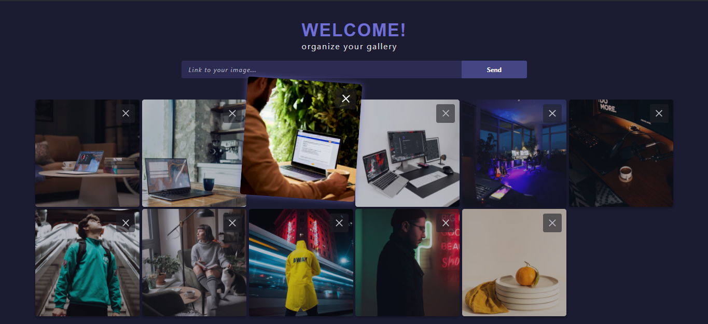
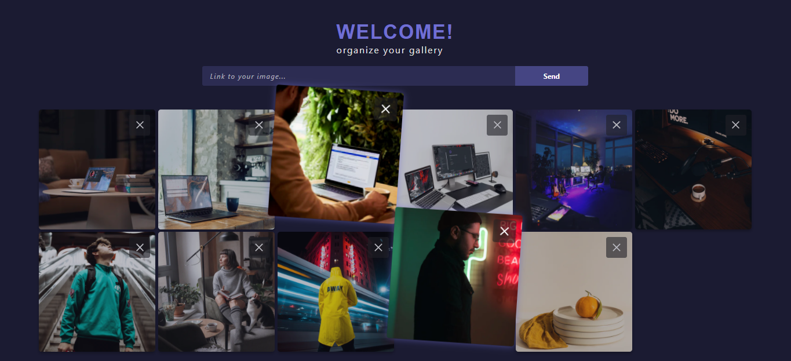

<h1 align="center">Image Gallery Study</h1>

  

  

# Live On

Enjoy [clicking here](https://gallery-manipulation.netlify.app/)

# What is it?

Study of the manipulation of the array in a gallery with manipulation of the position of the images using purely javascritp, html and css.
